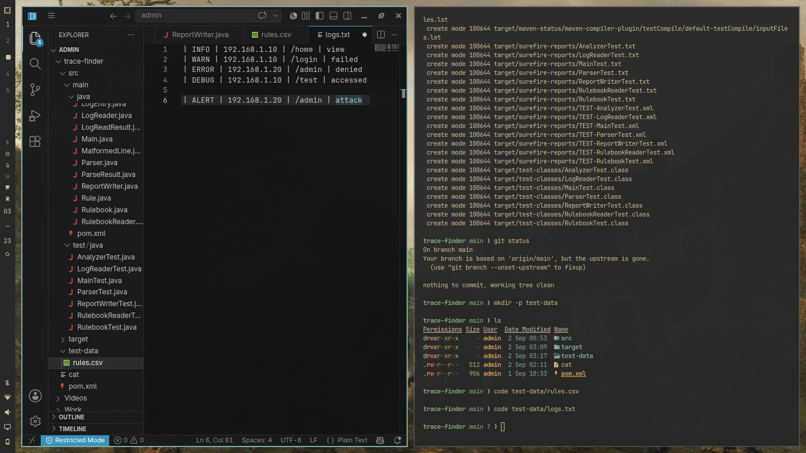
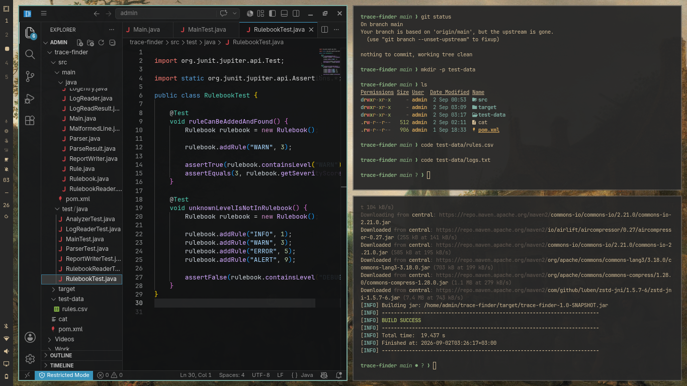
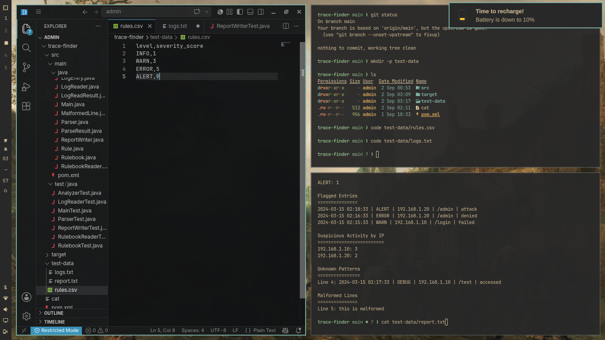
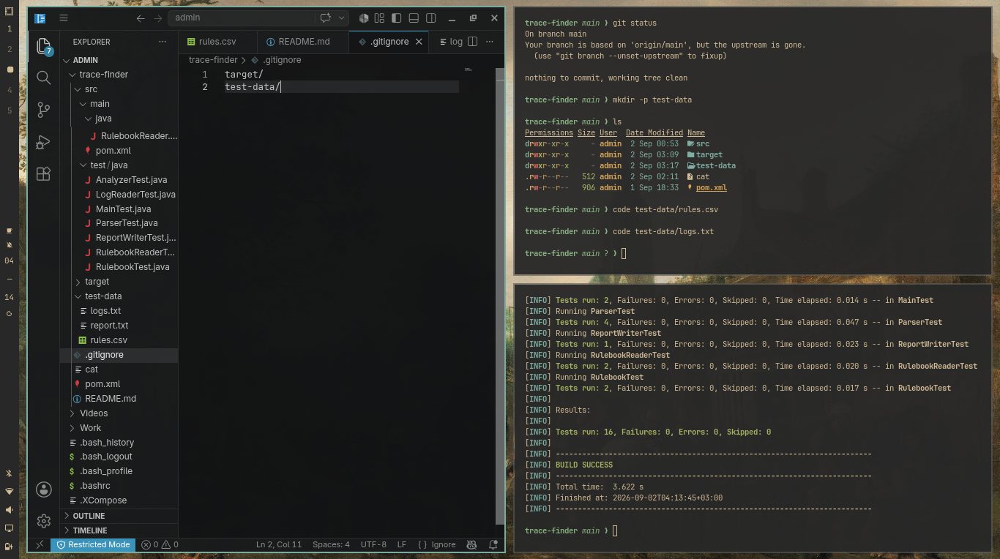

# TraceFinder

TraceFinder is a Java command-line application that analyzes access logs using a CSV-based rulebook. It identifies normal activity, flags entries with higher severity levels, detects unknown activity patterns, and reports malformed log lines.

The project was built as part of the Kood Software Development program using Java, Maven, JUnit, Git, and Linux.

## What It Does

TraceFinder takes three files as input:

```text
logs.txt rules.csv report.txt
```

* `logs.txt` — the access log to analyze
* `rules.csv` — the rulebook containing activity levels and severity scores
* `report.txt` — the report generated by TraceFinder

A valid log entry looks like:

```text
2024-03-15 02:14:33 | INFO | 192.168.1.10 | /home | view
```

The rulebook uses the following format:

```text
level,severity_score
```

Example:

```text
INFO,1
WARN,3
ERROR,5
ALERT,9
```

Entries with a severity score of **3 or higher** are flagged.

Unknown activity levels are reported separately, while malformed log lines are recorded with their line numbers and original content.

## Report

The generated report contains five sections:

1. **Activity Summary** — counts entries for each level defined in the rulebook.
2. **Flagged Entries** — lists entries with a severity score of 3 or higher.
3. **Suspicious Activity by IP** — shows the total number of valid entries associated with IP addresses that produced flagged activity.
4. **Unknown Patterns** — lists valid entries whose activity level is not present in the rulebook.
5. **Malformed Lines** — lists log lines that could not be parsed.

## Project Structure

The application is divided into separate classes so that each part of the process has a clear responsibility.

```text
src/
├── main/
│   └── java/
│       ├── Main.java
│       ├── Parser.java
│       ├── LogReader.java
│       ├── LogReadResult.java
│       ├── RulebookReader.java
│       ├── Rulebook.java
│       ├── Rule.java
│       ├── Analyzer.java
│       ├── AnalysisResult.java
│       ├── ReportWriter.java
│       ├── LogEntry.java
│       ├── MalformedLine.java
│       └── ParseResult.java
│
└── test/
    └── java/
        └── JUnit tests
```

## Running the Project

### Build

```bash
mvn package
```

### Run

```bash
java -cp target/classes Main logs.txt rules.csv report.txt
```

### Run Tests

```bash
mvn test
```

The current test suite contains **22 tests**, all of which pass successfully.

## Screenshots

### Test Results



### TraceFinder CLI



### Generated Report



### Project Structure



## Technologies Used

* Java 17
* Maven
* JUnit 5
* Git
* Linux

## Author


Built as part of the Kood Software Development program by Christine Nyambura


## Time Window Filtering

TraceFinder supports analysis of a selected time window using two additional arguments: `start timestamp` and `end timestamp`.

Timestamps must use the format `yyyy-MM-dd HH:mm:ss`.

Example:

```bash
java -cp target/classes Main test-data/logs.txt test-data/rules.csv report.txt "2024-03-15 02:00:00" "2024-03-15 03:30:00"
```

The window uses the `[start, end)` boundary rule: the start is inclusive and the end is exclusive. Equal start and end timestamps are valid and produce an empty analysis. A reversed window or unreadable timestamp is rejected with a nonzero exit code.

Malformed lines are still reported regardless of the selected window, and unknown-pattern line numbers remain unchanged.

Without the two timestamp arguments, the full file is analyzed.

## Coverage

Generate the JaCoCo coverage report with:

```bash
mvn test jacoco:report
```

The HTML report is generated at `target/site/jacoco/index.html`.

The current coverage report showed 84% instructions, 75% branches, 98% methods, 92% classes, and 84% lines.

Coverage shows which code was executed by tests; the boundary tests specifically verify the time-window behavior.

## Time Window Edge Cases Tested

- Start timestamp is included.
- End timestamp is excluded.
- Equal start and end timestamps produce an empty analysis.
- Reversed timestamps are rejected.
- Unreadable timestamps are rejected.
- Malformed lines remain in the report.
- Unknown pattern line numbers are preserved.
- Whole-file analysis continues to work without a time window.

